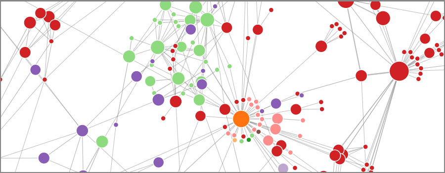

# Description

Analyze your XlsForms as directed graphs. Survey elements, such as
`select_one ...`, `calculate`, or `note` become nodes in such a graph. In other
words, the nodes of the graph are the individual XlsForm questions (rows in an
XlsForm). The edges are dependencies on other questions. If question `B` depends
on question `A` being answered a specific way (e.g. through `${...}` in the
relevant column), then an edge points from `A` to `B`. A dependency could also
be when a label in question `D` displays the value of survey element `C`. Here
an edge points from `C` to `D`.

# Installation

All package dependencies, `networkx` and `xlrd`, are on PyPI. To install, a
single `pip` call on the command line suffices:

```
python3 -m pip install https://github.com/jkpr/OdkGraph/zipball/master
```

# Usage

:white_check_mark: _First, make sure the ODK Xlsform converts cleanly to XML._ 

Import the `OdkGraph` class with

```python
from odkgraph import OdkGraph
```

Next, create an `OdkGraph` object. The `__init__` method accepts a path to the 
file:

```python
odk_graph = OdkGraph('/path/to/odk/xlsform.xlsx')
```

### Access Xlsform nodes

Access nodes through a variety of ways

```python
odk_graph['age']        # Get the ODK survey element (node) named 'age'
odk_graph[0]            # Zero-indexed node access. This example returns the first node
odk_graph.excel_row(2)  # Return the ODK survey element from row 2 in the Excel file
```

Slicing is also supported.

### Learn stuff

Some useful things this code does now that we have an `OdkGraph` object:

```python
odk_graph.number_edges()            # The number of edges (dependencies)
odk_graph.number_nodes()            # The number of nodes (survey elements)
odk_graph.forward_dependencies()    # The ODK elements that depend on things that are defined after them in the Xlsform
odk_graph.terminal_nodes()          # The ODK elements that depend on other elements, but nothing depends on them
odk_graph.isolates()                # The ODK elements that depend on nothing else, and nothing depends on them
odk_graph.simple_cycles()           # A list of cyclical dependencies
```

With node(s) in hand, we can do

```python
age = odk_graph['age']
odk_graph.predecessors(age)             # All nodes that 'age' directly depends on
odk_graph.successors(age)               # All nodes that directly depend on 'age'
odk_graph.all_dependencies_of([age])    # All nodes that 'age directly or indirectly depends on
odk_graph.all_nodes_dependent_on([age]) # All nodes that directly or indirectly depend on 'age'
```


The underlying `networkx` network ([documentation here](https://networkx.github.io/documentation/stable/index.html)) can be accessed with

```python
odk_graph.network
```


See all methods and attributes on `OdkGraph` and their docstrings with

```python
help(OdkGraph)
```
or by reading the [source code](https://github.com/jkpr/OdkGraph/blob/master/odkgraph/odkgraph.py).

# Bugs

Submit bug reports to James K. Pringle at jpringleBEAR@jhu.edu minus the bear.
